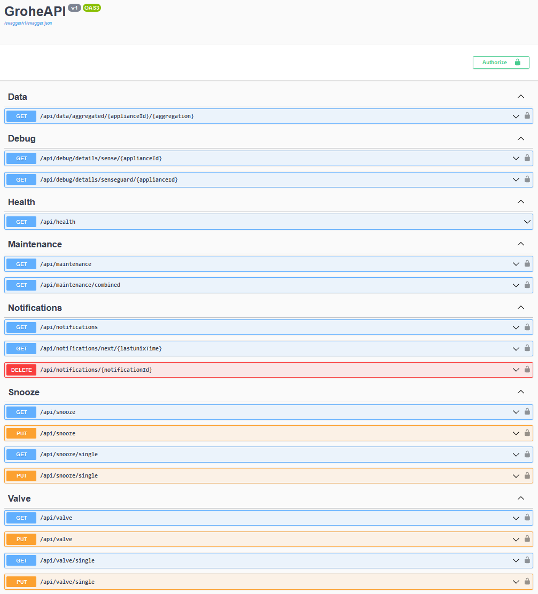

# grohe-api
A C# implementation of the Grohe Sense API, exposing a Swagger / Swashbuckle web interface for further integration.
This was mainly written with the intent to further integrate it with the Homey smart hub, but I'm sure it's useful for other things as well, if only to save you the work of decompiling the Grohe Android app and circumventing certificate pinning, and so on, when making your own edition.

