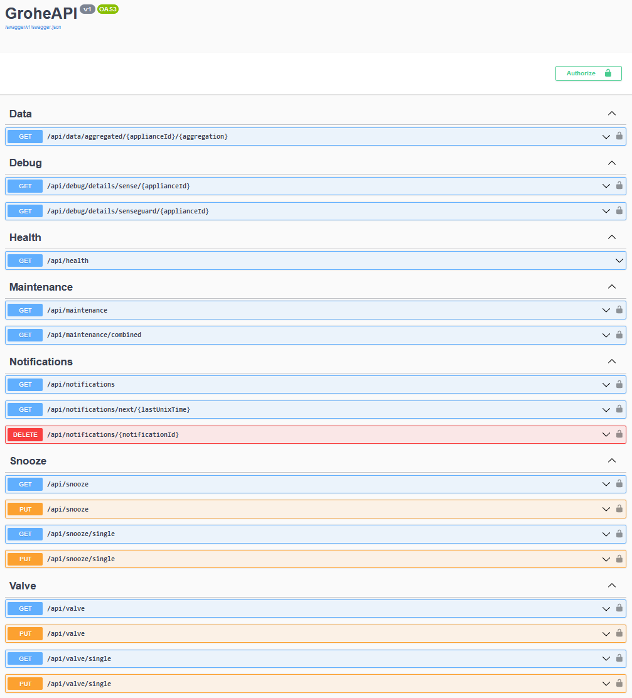

# grohe-api
A C# implementation of the Grohe Sense API, exposing a Swagger / Swashbuckle web interface for easier integration with home automation systems and similar.

## Implemented features
* Turning on and off the water valves of SenseGuard
* Snoozing a SenseGuard so it doesn't interfere with sprinklers or washing machines in 'eco' mode
* Listing and easily iterating notifications, as well as marking them as read or deleting them
* Checking battery levels and when devices last reported

## Homey
This was mainly written with the intent to further integrate it with the Homey smart hub, but I'm sure it's useful for other things as well, if only to save you the work of decompiling the Grohe Android app and circumventing certificate pinning, and so on, when making your own edition.

### Example homey usage
